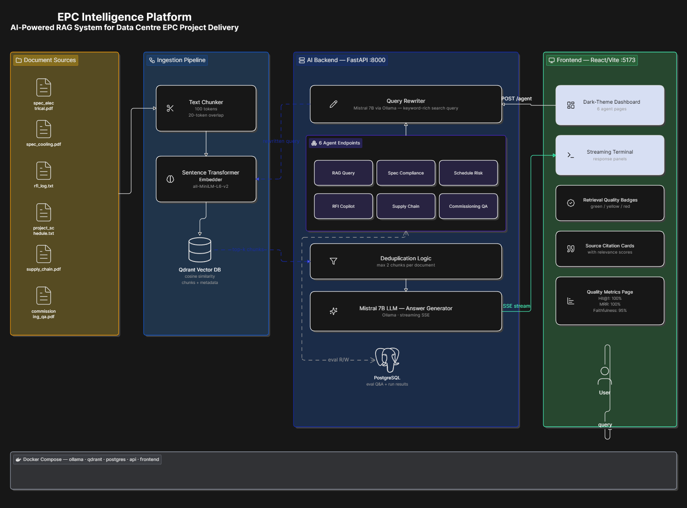
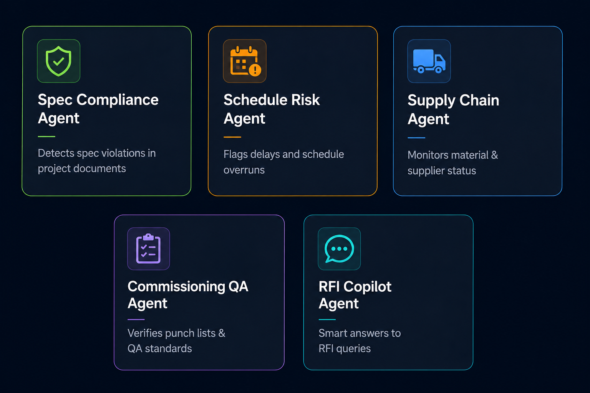
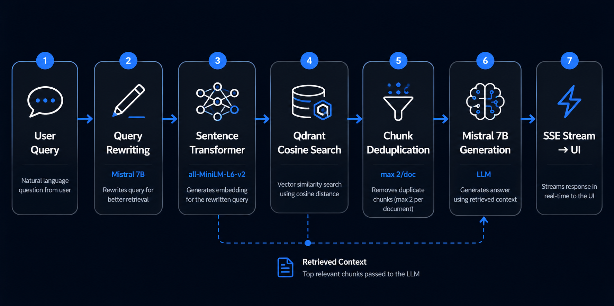
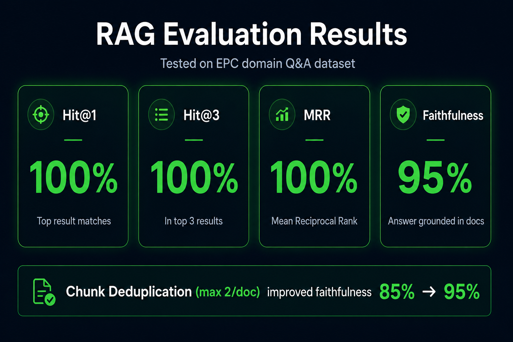

<div align="center">

# 🏗️ EPC Intelligence Platform

### AI-Powered Multi-Agent RAG System for Data Centre EPC Project Delivery

[](https://python.org)
[](https://fastapi.tiangolo.com)
[](https://react.dev)
[](https://mistral.ai)
[](https://docker.com)
[](LICENSE)

> **ET AI Hackathon 2026** — A production-grade, fully containerised multi-agent AI platform that lets EPC engineers query complex project documents in natural language, with answers grounded in source documents, cited with relevance scores, and streamed in real-time.



</div>

---

## 📋 Table of Contents

- [Overview](#overview)
- [Domain Intelligence Agents](#-domain-intelligence-agents)
- [RAG Pipeline](#️-rag-pipeline)
- [Evaluation Results](#-evaluation-results)
- [Quick Start](#-quick-start)
- [Docker Services](#-docker-services)
- [Project Structure](#-project-structure)
- [API Reference](#-api-reference)
- [Tech Stack](#️-tech-stack)
- [Document Upload Guide](#-document-upload-guide)
- [Evaluation Pipeline](#-evaluation-pipeline)
- [Troubleshooting](#️-troubleshooting)

---

## Overview

EPC Intelligence is a fully containerised multi-agent RAG (Retrieval-Augmented Generation) platform designed for Engineering, Procurement, and Construction (EPC) data centre projects. Project engineers and managers can upload specification documents, RFI logs, schedules, supply chain reports, and commissioning punch lists — then query all of them through specialised AI agents that return grounded, cited answers streamed in real-time.

**What makes it different from a simple chatbot:**

- **Grounded answers only** — the LLM is strictly constrained to retrieved context; it cannot hallucinate from training data
- **5 domain-specialised agents** — each agent queries only documents of its own type, producing far more precise outputs
- **Query rewriting** — Mistral 7B first rewrites your natural language question into retrieval-optimised keywords before embedding, improving semantic search recall
- **Chunk deduplication** — a custom deduplication pass (max 2 chunks per document) ensures answers draw from diverse sources rather than repeating the same file
- **Retrieval Quality Badges** — every answer shows a 🟢 / 🟡 / 🔴 badge based on cosine similarity score, giving users an instant confidence signal
- **Automated evaluation** — the platform auto-generates Q&A pairs from uploaded documents and runs a full RAG evaluation pipeline (Hit@1/3/5, MRR, Faithfulness) as a non-blocking background task

---

## 🤖 Domain Intelligence Agents



The platform ships with 6 intelligent endpoints — one general RAG query and five domain-specialised agents:

| Agent | Endpoint | Document Type | Output Format |
|-------|----------|--------------|---------------|
| **RAG Query** | `POST /query/stream` | All types | General Q&A with cited sources |
| **Spec Compliance** | `POST /agents/spec-compliance/stream` | `specification` | COMPLIANT / NON-COMPLIANT / REQUIRES VERIFICATION |
| **Schedule Risk** | `POST /agents/schedule-risk/stream` | `schedule` | HIGH / MEDIUM / LOW risk + recommendations |
| **RFI Copilot** | `POST /agents/rfi-copilot/stream` | `rfi` | Similar RFIs, past resolutions, open items |
| **Supply Chain** | `POST /agents/supply-chain/stream` | `supply_chain` | CRITICAL / AT RISK / ON TRACK + item list |
| **Commissioning QA** | `POST /agents/commissioning-qa/stream` | `commissioning` | PASS / FAIL / PARTIAL + Tier III readiness |

All agent endpoints use **Server-Sent Events (SSE)** for real-time token streaming. Each response appends a `__META__` + `__SOURCES__` trailer with structured metadata (status, rewritten query, retrieval score) that the frontend parses to display badges and source citation cards.

---

## ⚙️ RAG Pipeline



Every query flows through this 7-step pipeline:

| Step | Component | Detail |
|------|-----------|--------|
| 1 | **Query Understanding** | User submits natural language question via React UI |
| 2 | **Query Rewriting** | Mistral 7B rewrites it into keyword-rich retrieval terms (20s timeout, falls back to original on failure) |
| 3 | **Embedding** | `all-MiniLM-L6-v2` encodes the rewritten query into a 384-dimensional vector |
| 4 | **Cosine Search** | Qdrant retrieves top-20 candidates using cosine similarity, filtered by `doc_type` |
| 5 | **Chunk Deduplication** | Custom pass keeps max 2 chunks per filename from top-20, returns final top-5 |
| 6 | **LLM Generation** | Mistral 7B generates a grounded, source-cited answer from the retrieved context |
| 7 | **SSE Stream** | Response is streamed token-by-token to the React UI via FastAPI `StreamingResponse` |

---

## 📊 Evaluation Results



The Quality Metrics dashboard (📊 in sidebar) shows automated RAG evaluation results computed on auto-generated Q&A pairs from uploaded documents:

| Metric | Score | What It Measures |
|--------|-------|-----------------|
| **Hit@1** | **100%** | Correct source document appears in position #1 of retrieved results |
| **Hit@3** | **100%** | Correct source document appears in top 3 retrieved results |
| **Hit@5** | **100%** | Correct source document appears in top 5 retrieved results |
| **MRR** | **100%** | Mean Reciprocal Rank — average of 1/rank across all questions |
| **Faithfulness** | **95%** | LLM-judged score: every claim in the answer is supported by retrieved context |

> **Key design decision:** Chunk deduplication (max 2 chunks per document) improved Faithfulness from **85% → 95%** by ensuring the LLM sees context from multiple diverse sources rather than 5 chunks from a single file.

---

## 🚀 Quick Start

### Prerequisites

| Requirement | Version | Notes |
|-------------|---------|-------|
| **Docker Desktop** | 4.x+ | Must have Docker Compose v2 — use `docker compose`, not `docker-compose` |
| **RAM** | 8 GB+ minimum | Mistral 7B requires ~5–6 GB when loaded |
| **Disk** | 10 GB+ free | ~4.1 GB for model weights + container images |
| **OS** | Windows / macOS / Linux | Tested on Windows 11 with Docker Desktop |

---

### Step 1 — Clone the Repository

```bash
git clone https://github.com/<your-username>/epc-intelligence.git
cd epc-intelligence
```

---

### Step 2 — Start All Services

```bash
docker compose up -d
```

This starts **6 containers** in the correct dependency order:

```
epc_ollama       — Ollama LLM runtime server
epc_ollama_init  — One-shot: pulls mistral:7b model (~4.1 GB, first run only)
epc_postgres     — PostgreSQL 16 (eval Q&A + run results)
epc_qdrant       — Qdrant vector database
epc_api          — FastAPI backend on port 8000
epc_frontend     — React/Vite frontend on port 5173
```

---

### Step 3 — Wait for Mistral 7B to Download *(First Run Only)*

```bash
docker logs epc_ollama_init -f
```

Wait until you see:

```
Model ready.
```

This downloads the `mistral:7b` model (~4.1 GB). Subsequent starts are **instant** — the model is cached in the `ollama_data` Docker volume.

---

### Step 4 — Verify All Services Are Running

```bash
curl http://localhost:8000/health
```

Expected response:

```json
{
  "status": "ok",
  "services": {
    "qdrant":   { "status": "ok", "documents": 0 },
    "ollama":   { "status": "ok", "mistral_ready": true },
    "postgres": { "status": "ok" }
  }
}
```

> If `mistral_ready` is `false`, Mistral is still loading. Wait 30–60 seconds and retry.

---

### Step 5 — Open the Application

```
http://localhost:5173
```

The sidebar status indicator turns **green** (● Online) when all services are healthy.

---

### Step 6 — Upload Seed Documents

The `seed_data/` folder contains pre-built sample EPC documents. Upload them all with a single command:

```bash
cd seed_data
pip install httpx fpdf2
python upload_seeds.py
```

This uploads **6 documents** across all 5 domain types:

| File | doc_type | Used By |
|------|----------|---------|
| `spec_electrical.pdf` | `specification` | Spec Compliance Agent |
| `spec_cooling.pdf` | `specification` | Spec Compliance Agent |
| `project_schedule.pdf` | `schedule` | Schedule Risk Agent |
| `rfi_log.pdf` | `rfi` | RFI Copilot Agent |
| `supply_chain.pdf` | `supply_chain` | Supply Chain Agent |
| `commissioning_qa.pdf` | `commissioning` | Commissioning QA Agent |

> `.txt` files in `seed_data/docs/` are automatically converted to PDF by `upload_seeds.py` before upload. The API accepts **PDF only**.

After upload, navigate to the **Documents** tab (📁) to confirm all 6 files are indexed.

---

### Step 7 — Run Your First Query

1. Click **RAG Query** (🔍) in the sidebar
2. Type: *"What are the electrical specifications for the UPS system?"*
3. Click **Send**
4. Watch the answer stream in real-time — source citations and retrieval badge appear after streaming completes

---

### Step 8 — Try the Domain Agents

Each agent page works identically. Try these example queries:

- **Spec Compliance** → *"Does the cooling system meet TIA-942 requirements?"*
- **Schedule Risk** → *"What activities are currently behind schedule?"*
- **RFI Copilot** → *"Has there been an RFI about cable tray spacing?"*
- **Supply Chain** → *"Which equipment deliveries are at risk of delay?"*
- **Commissioning QA** → *"What open NCRs must be resolved before Tier III audit?"*

---

## 🐳 Docker Services

| Service | Container | Port | Image |
|---------|-----------|------|-------|
| LLM Runtime | `epc_ollama` | 11434 | `ollama/ollama` |
| Backend API | `epc_api` | 8000 | Custom (`./api/Dockerfile`) |
| Frontend | `epc_frontend` | 5173 | Custom (`./frontend/Dockerfile`) |
| Vector DB | `epc_qdrant` | 6333 | `qdrant/qdrant` |
| Database | `epc_postgres` | 5432 | `postgres:16` |

### Common Commands

```bash
# Start all services (detached)
docker compose up -d

# Stop all services (data volumes preserved)
docker compose down

# Stop and delete ALL data (⚠️ resets vectors, eval data, uploaded files)
docker compose down -v

# View live logs for a service
docker logs epc_api -f
docker logs epc_ollama -f
docker logs epc_frontend -f

# Rebuild containers after code changes to api/ or frontend/
docker compose up -d --build

# Restart frontend only (needed when UI changes don't appear after file edits)
docker compose restart frontend

# Manually pull Mistral model (if ollama-init container failed)
docker exec epc_ollama ollama pull mistral:7b

# Open interactive shell inside API container
docker exec -it epc_api bash

# Reset only the Qdrant vector collection (keeps PostgreSQL data)
docker exec epc_api python reset_collection.py
```

---

## 📁 Project Structure

```
epc-intelligence/
├── api/
│   ├── main.py                  # FastAPI — all endpoints, agents, eval pipeline
│   ├── requirements.txt         # Python dependencies
│   ├── reset_collection.py      # Utility to wipe Qdrant collection
│   └── Dockerfile
│
├── frontend/
│   ├── src/
│   │   ├── App.jsx              # Root component, navigation, health polling
│   │   └── components/
│   │       ├── Dashboard.jsx        # Home overview with quick stats
│   │       ├── Query.jsx            # General RAG Query (SSE streaming)
│   │       ├── SpecCompliance.jsx   # Spec Compliance Agent UI
│   │       ├── ScheduleRisk.jsx     # Schedule Risk Agent UI
│   │       ├── RFICopilot.jsx       # RFI Copilot Agent UI
│   │       ├── SupplyChain.jsx      # Supply Chain Agent UI
│   │       ├── CommissioningQA.jsx  # Commissioning QA Agent UI
│   │       ├── Documents.jsx        # Document browser with chunk viewer
│   │       ├── Upload.jsx           # File upload with doc_type selector
│   │       └── EvalDashboard.jsx    # Quality Metrics / RAG Evaluation
│   ├── vite.config.js           # Vite proxy: /api/* → localhost:8000
│   ├── tailwind.config.js
│   └── Dockerfile
│
├── seed_data/
│   ├── docs/
│   │   ├── spec_electrical.txt      # Electrical specification (seed)
│   │   ├── spec_cooling.txt         # Cooling specification (seed)
│   │   ├── project_schedule.txt     # Project schedule (seed)
│   │   └── rfi_log.txt              # RFI log (seed)
│   ├── supply_chain.pdf             # Supply chain report (seed)
│   ├── commissioning_qa.pdf         # Commissioning QA report (seed)
│   └── upload_seeds.py              # Upload script (converts .txt → PDF automatically)
│
├── tests/
│   └── test_api.py                  # API integration tests
│
├── docker-compose.yml               # Orchestrates all 5 services with health checks
│
└── docs/
    └── images/                      # ← Place all diagram images here
        ├── architecture-diagram.png
        ├── rag-pipeline-flow.png
        ├── agent-overview.png
        ├── eval-metrics.png
        ├── vector-embedding-space.png   # (PDF document only)
        ├── rag-vs-no-rag.png            # (PDF document only)
        └── chunk-deduplication.png      # (PDF document only)
```

---

## 🔌 API Reference

All endpoints are served at `http://localhost:8000`. The Vite frontend proxies `/api/*` requests to this port.

### Health Check

```http
GET /health
```

Returns the status of all backend services and total document count in Qdrant.

---

### Documents

```http
POST /documents/upload
Content-Type: multipart/form-data

file:     <PDF binary>
doc_type: specification | schedule | rfi | supply_chain | commissioning
```

```http
GET /documents
GET /documents/{doc_id}/chunks
```

---

### RAG Query — SSE Stream

```http
POST /query/stream
Content-Type: application/json

{
  "question": "What are the power density requirements per rack?",
  "doc_type": null,
  "top_k": 5
}
```

Response is a `text/plain` SSE stream. The last line contains:
```
__META__{"rewritten_query": "...", "retrieval_score": 0.82}__SOURCES__[{...}, ...]
```

---

### Domain Agent Endpoints — all SSE streams

```http
POST /agents/spec-compliance/stream
POST /agents/schedule-risk/stream
POST /agents/rfi-copilot/stream
POST /agents/supply-chain/stream
POST /agents/commissioning-qa/stream

Body: { "question": "...", "top_k": 5 }
```

---

### Evaluation

```http
# Start background eval (returns immediately — non-blocking)
POST /eval/run
Response: { "status": "started", "total_questions": 20 }

# Poll eval progress
GET /eval/status
Response: { "running": true|false, "last_run_id": "uuid", "error": null }

# Get latest run summary
GET /eval/runs/latest
Response: { "hit_at_1": 1.0, "hit_at_3": 1.0, "hit_at_5": 1.0, "mrr": 1.0, "avg_faithfulness": 0.95, ... }

# Per-question results for a specific run
GET /eval/runs/{run_id}/results

# List all auto-generated eval Q&A pairs
GET /eval/questions?validated=true&rejected=false
```

---

## 🛠️ Tech Stack

| Layer | Technology | Version / Detail |
|-------|------------|-----------------|
| **LLM** | Mistral 7B via Ollama | `mistral:7b` — query rewriting + answer generation + faithfulness scoring |
| **Embeddings** | `all-MiniLM-L6-v2` | 384-dimensional vectors, SentenceTransformers 3.0.1 |
| **Vector DB** | Qdrant | Cosine similarity index, filtered search by `doc_type` |
| **Backend** | FastAPI + Uvicorn | v0.111.0, async/await, `BackgroundTasks` for non-blocking eval |
| **Streaming** | Server-Sent Events (SSE) | `StreamingResponse`, token-by-token via Ollama's streaming API |
| **Database** | PostgreSQL 16 | Eval Q&A pairs, run summaries, per-question results |
| **PDF Parsing** | pdfplumber | v0.11.1, text extraction from PDF pages |
| **Frontend** | React 18 + Vite + Tailwind CSS | Dark slate theme, real-time streaming panels |
| **Infrastructure** | Docker Compose | 5 services with health checks, live volume mounts |

---

## 📝 Document Upload Guide

Use the correct `doc_type` when uploading — each agent filters Qdrant to its own type:

| What You're Uploading | `doc_type` Value | Agent That Uses It |
|----------------------|-----------------|-------------------|
| Electrical / Mechanical / Structural specs | `specification` | Spec Compliance Agent |
| Gantt charts, project schedules, milestone trackers | `schedule` | Schedule Risk Agent |
| RFI logs, issue trackers, clarification registers | `rfi` | RFI Copilot Agent |
| Procurement reports, delivery schedules, vendor data | `supply_chain` | Supply Chain Agent |
| Commissioning test reports, punch lists, NCR logs | `commissioning` | Commissioning QA Agent |

The **RAG Query** page searches across **all document types** simultaneously (no filter applied).

---

## 🧪 Evaluation Pipeline

**How the automated RAG evaluation works:**

1. **Auto-generation** — When each document is uploaded, Mistral 7B generates 5 Q&A pairs from its content and stores them in PostgreSQL.
2. **Validation** — In the Quality Metrics dashboard, questions can be validated ✅ or rejected ❌. Only validated questions are used in eval runs.
3. **Background eval** — "Run Eval" POSTs to `/eval/run`, which starts evaluation via FastAPI `BackgroundTasks` and returns immediately (HTTP 200). The frontend polls `/eval/status` every 8 seconds.
4. **Metrics computed:** Hit@1, Hit@3, Hit@5, MRR, and Faithfulness (LLM-scored 0–10, normalised to 0.0–1.0)
5. **Results persisted** — Each run is saved to `eval_runs` and `eval_results` tables with per-question breakdowns.

**Running API tests:**

```bash
docker exec epc_api python -m pytest /app/../tests/test_api.py -v
```

---

## ⚠️ Troubleshooting

| Symptom | Cause | Fix |
|---------|-------|-----|
| UI shows old version after editing source files | Vite HMR doesn't detect inotify events from Windows host inside Docker | `docker compose restart frontend`, then hard-refresh with `Ctrl+Shift+R` |
| `mistral_ready: false` in health check | Model still downloading or loading | `docker logs epc_ollama_init -f` — wait for `Model ready.` |
| Upload returns 400 "Only PDF files supported" | Uploading `.txt` directly | Use `upload_seeds.py` which auto-converts `.txt → PDF`, or convert manually |
| Eval returns "No validated questions" | Questions generated but not validated yet | Go to Quality Metrics → Q&A Bank tab → click ✅ to validate questions |
| POST `/eval/run` returns 409 Conflict | Eval already running | Poll `GET /eval/status` until `running: false` |
| Frontend shows blank white screen | API container still initialising | Wait ~30 seconds for DB and Qdrant setup, then refresh |
| Agent returns "No documents found" | No documents of that `doc_type` uploaded | Upload at least one document with the correct `doc_type` |

---

<div align="center">

**ET AI Hackathon 2026** · Built with Mistral 7B · FastAPI · Qdrant · React · Docker Compose

*Runs 100% on-premise — no external API keys required*

</div>
